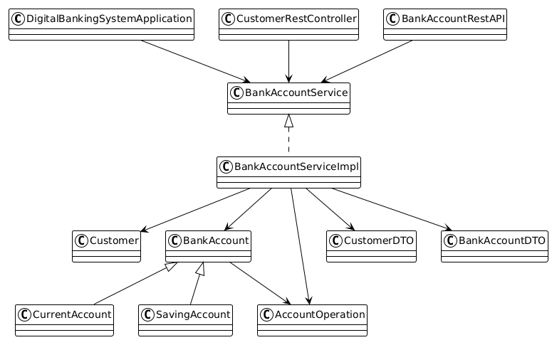
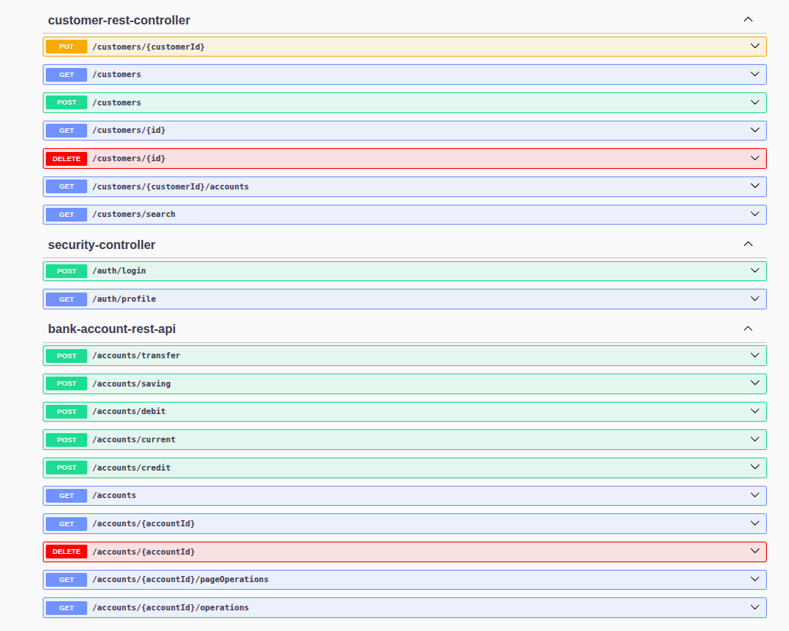
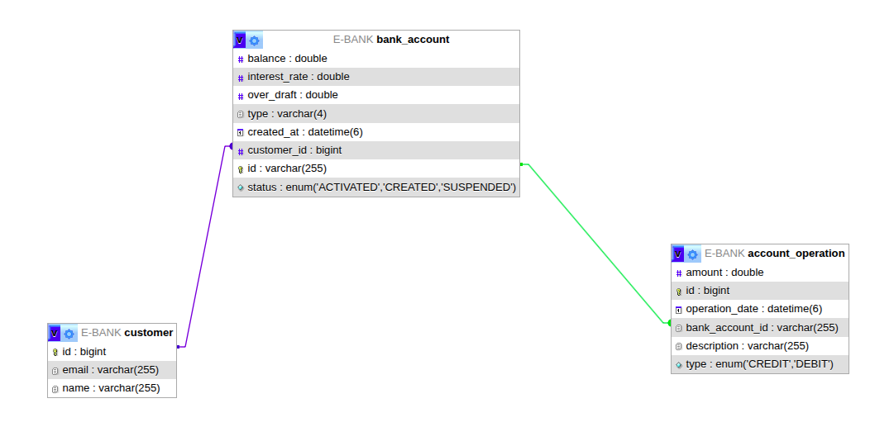
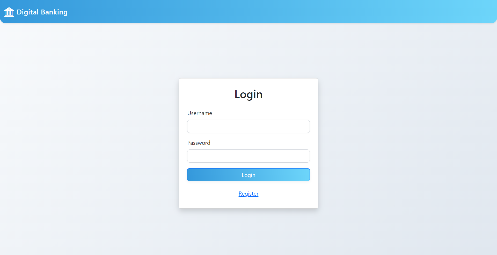
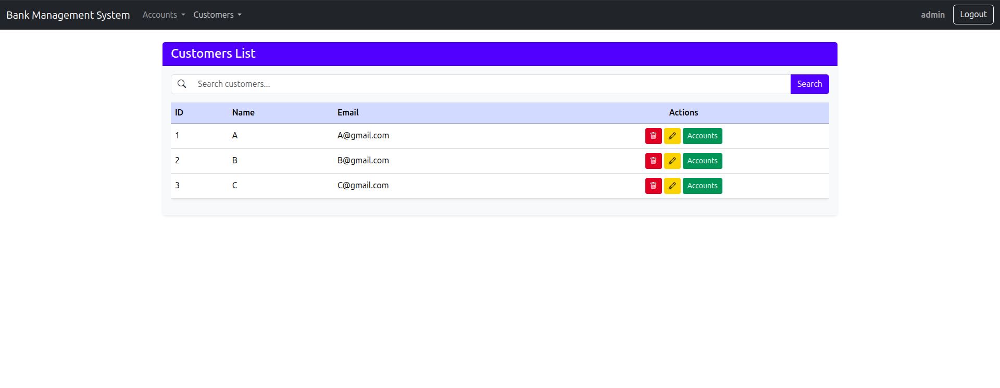
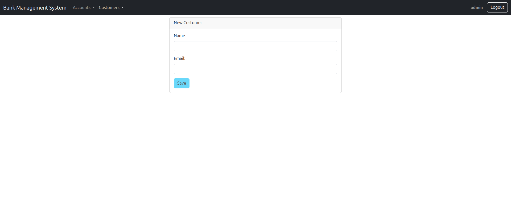
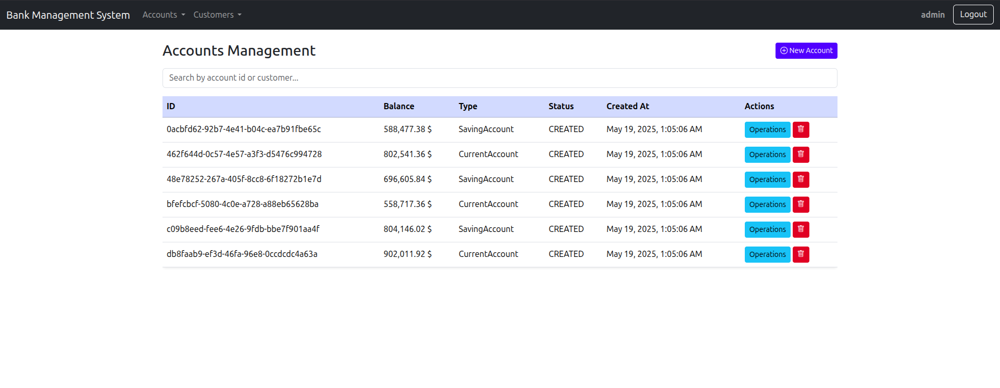
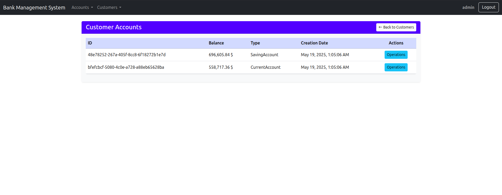
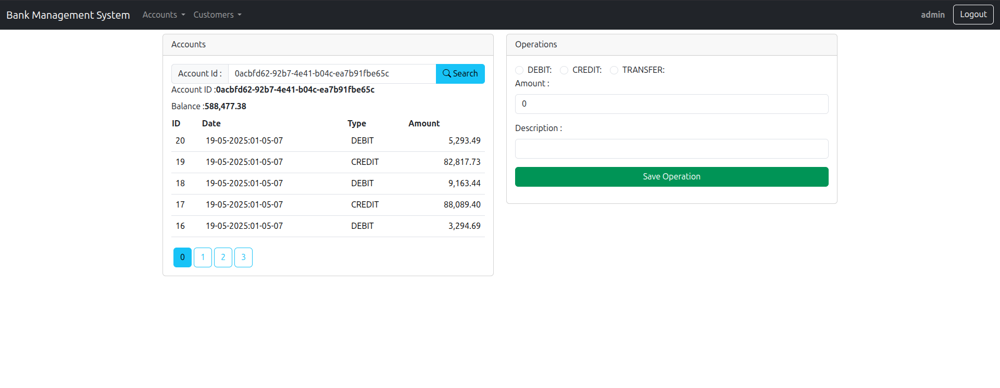

# 🌐 Digital Banking System – Project Report

---

## 📑 Table of Contents
1. [Project Overview](#project-overview)
2. [Technologies Used](#technologies-used)
3. [Project Directory Structure](#project-directory-structure)
4. [Backend: Spring Boot Application](#backend-spring-boot-application)
   - [Structure](#backend-structure)
   - [Main Classes & Features](#main-classes--features)
   - [Security](#security)
   - [How to Run](#how-to-run-backend)
5. [Frontend: Angular Application](#frontend-angular-application)
   - [Structure](#frontend-structure)
   - [Main Components & Features](#main-components--features)
   - [How to Run](#how-to-run-frontend)
6. [System Diagrams](#system-diagrams)
7. [Frontend UI Screenshots](#frontend-ui-screenshots)


---

## 📝 Project Overview
A full-stack digital banking system with a secure backend REST API (Spring Boot) and Angular frontend. Features include management of customers, accounts, and banking operations (credit, debit, transfer), with authentication and authorization.

---

## 🚀 Technologies Used
- **Backend:** Java 21 · Spring Boot 3 · Spring Data JPA · Spring Security (JWT) · MySQL · Maven
- **Frontend:** Angular 19 · Bootstrap 5 · RxJS · JWT-decode

---

## 📁 Project Directory Structure
```text
├── backend
│   ├── pom.xml
│   ├── src
│   │   ├── main
│   │   └── test
│   └── target
├── frontend
│   ├── angular.json
│   ├── package.json
│   ├── public
│   ├── README.md
│   ├── src
│   │   ├── app
│   │   ├── environments
│   │   ├── index.html
│   │   ├── main.ts
│   │   ├── server.ts
│   │   └── styles.css
│   ├── tsconfig.app.json
│   ├── tsconfig.json
│   └── tsconfig.spec.json
├── screenshots
│   ├── login.png
│   ├── customers.png
│   ├── addCustomer.png
│   ├── accounts.png
│   ├── customer-accounts.png
│   ├── operations.png
│   ├── backend_diagram_class.png
│   ├── db_schema.png
│   └── swagger.png
├── readme.md
```

---

## 🛠️ Backend: Spring Boot Application

### Backend Structure
- **Main Class:** `DigitalBankingSystemApplication.java`
- **Entities:** `Customer`, `BankAccount` (`CurrentAccount`, `SavingAccount`), `AccountOperation`
- **DTOs:** For data transfer (`CustomerDTO`, `BankAccountDTO`, etc.)
- **Repositories:** JPA repositories for all entities
- **Services:** Business logic in `BankAccountService`/`BankAccountServiceImpl`
- **Controllers:**
  - `CustomerRestController` (customer management)
  - `BankAccountRestAPI` (account operations)
- **Security:**
  - JWT-based authentication (`SecurityConfig`, `SecurityController`)
  - Role-based access control
- **Exception Handling:** Custom exceptions for business logic
- **Mappers:** DTO/entity conversion

#### Directory Structure
- `entities/` – JPA entities
- `dtos/` – Data Transfer Objects
- `repositories/` – Spring Data JPA repositories
- `services/` – Business logic
- `web/` – REST controllers
- `security/` – Security configuration and controllers
- `exceptions/` – Custom exception classes
- `mappers/` – DTO/entity mappers

### Backend Class Diagram


### Main Classes & Features
- **Customer Management:** CRUD operations, search, and retrieval
- **Account Management:** Create current/saving accounts, view details
- **Operations:** Credit, debit, transfer, and account history

### Backend REST API


### Security
- **JWT Authentication:** Secure login, token-based access
- **Role-based Authorization:** Admin/User roles, method-level security
- **Endpoints:** `/auth/login`, `/auth/profile`, protected REST endpoints

### Database Schema


### How to Run Backend
1. Configure MySQL in `application.properties` (default: root, no password)
2. From `backend/` directory, run:
   ```bash
   ./mvn spring-boot:run
   ```
3. API available at [http://localhost:8084/](http://localhost:8084/)

---

## 💻 Frontend: Angular Application

### Frontend Structure
- **Main Entry:** `src/main.ts`, `src/app/app.component.ts`
- **Components:**
  - `accounts/`, `customers/`, `account-operations/`, `customer-accounts/`, `login/`, `navbar/`, etc.
- **Services:**
  - `accounts.service.ts`, `customer.service.ts`, `auth.service.ts`
- **Guards:**
  - `authentification.guard.ts`, `authorization.guard.ts`
- **Interceptors:**
  - `app-http.interceptor.ts` (for JWT and error handling)
- **Models:**
  - `account.model.ts`, `customer.model.ts`

#### Directory Structure
- `accounts/`, `customers/`, `account-operations/`, etc. – UI components
- `services/` – API communication
- `guards/` – Route protection
- `interceptors/` – HTTP interceptors
- `model/` – TypeScript models

### Main Components & Features
- **Authentication:** Login form, JWT storage, protected routes
- **Customer Management:** List, add, edit, search customers
- **Account Management:** List, create, view accounts
- **Account Operations:** Credit, debit, transfer, view history
- **Navigation:** Responsive navbar, route guards
- **UI:** Bootstrap-based, responsive design

### How to Run Frontend
1. From `frontend/` directory, install dependencies:
   ```bash
   npm install
   ```
2. Start the development server:
   ```bash
   ng serve
   ```
3. App available at [http://localhost:4200/](http://localhost:4200/)

---

## 📊 System Diagrams
- **Backend Class Diagram:** 
- **Database Schema:** 
- **Backend REST API (Swagger):** 

---

## 🖼️ Frontend UI Screenshots

#### Login Page



#### Customers List



#### Add Customer (ADMIN only)



#### Accounts List (ADMIN only)



#### Customer Accounts



#### Account Operations (Operations - ADMIN only)



---